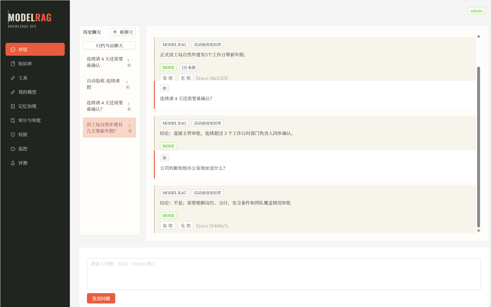
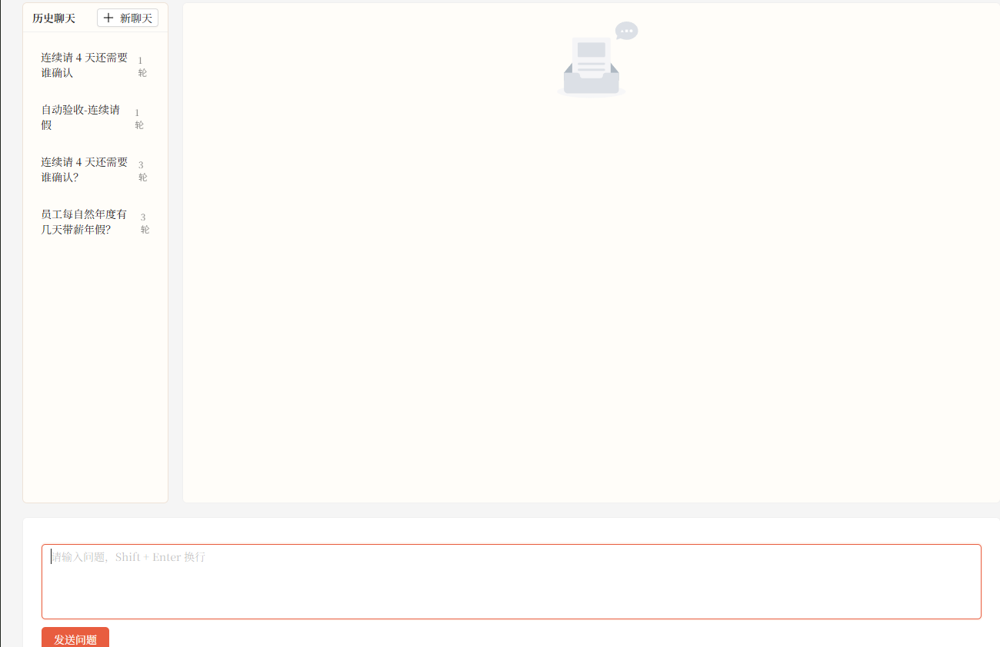
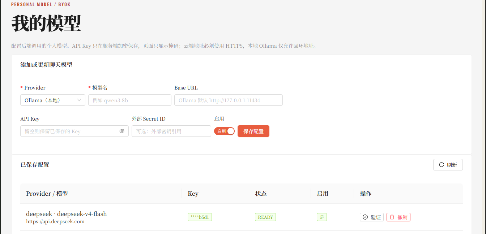
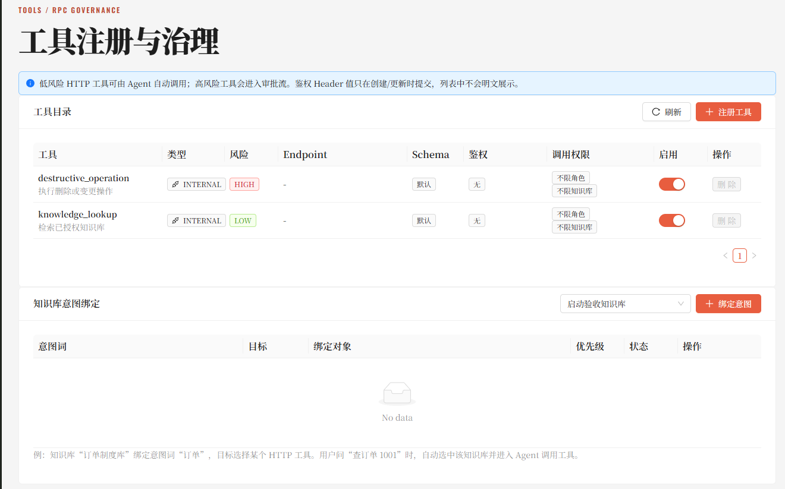
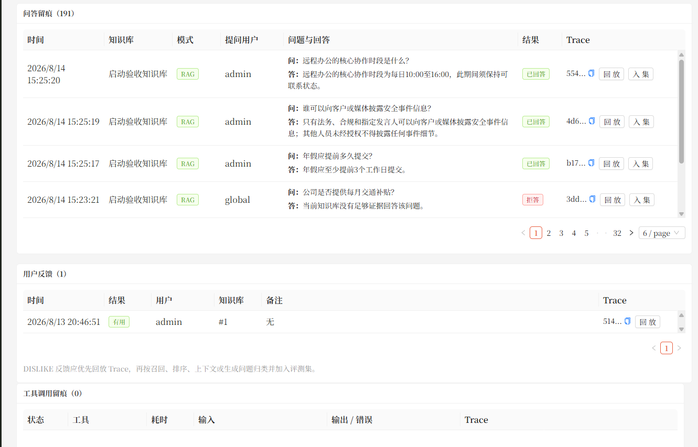
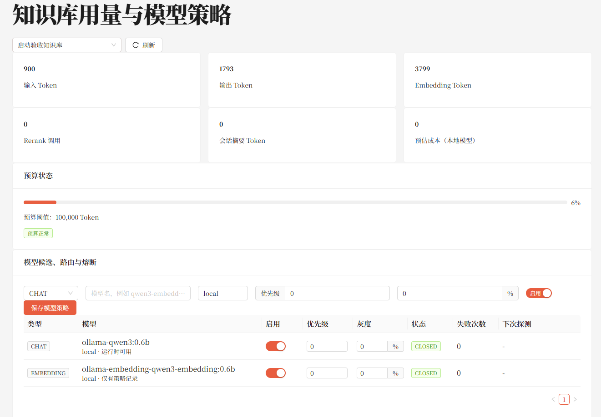
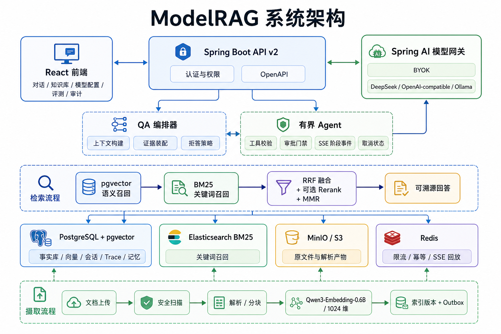

# ModelRAG

> 一个围绕“私有文档解析 -> RAG 检索增强 -> LLM 可溯源回答 -> 有界 Agent 执行”构建的企业级知识助手平台。

ModelRAG 的核心思路是把企业内部文档先变成可治理、可检索、可追踪的知识资产，再把这些证据交给 LLM 生成回答。系统会对私有文档进行上传、对象存储、安全扫描、解析、分块、Embedding、向量索引和 BM25 索引同步；用户提问时，先从私有知识库中召回证据，再由大模型基于证据回答，并返回引用来源和 trace。

当前项目更关注：文档从哪里来、证据是否命中、答案是否可追溯、没有证据时是否拒答、不同用户能不能只看自己有权限的知识库、模型 Key 如何管理、Agent 工具调用如何审批和审计。

基于Java 21、Spring Boot 4.1 和 Spring AI 2.0 开发；PostgreSQL/pgvector 负责事实库和语义向量检索；Elasticsearch 负责 BM25 关键词召回；React 提供前端控制台。




## 核心亮点

- **固定 30 条企业制度评测集已闭合**：最近一次本地评测 `task #5` 共 30 条样本，其中 27 条应回答、3 条应拒答。
- **回答质量治理后达到当前验收线**：`Recall@5=1.000`、`Context Recall=1.000`、`Answer Accuracy=1.000`、`Refusal Accuracy=1.000`、`Faithfulness=0.917`。
- **证据优先的 RAG 链路**：pgvector 语义检索 + Elasticsearch BM25 并行召回，融合排序后再组织可引用上下文；无证据和敏感问题按拒答策略处理。
- **有界 Agent 执行**：Agent 有最大步数、总超时、工具校验、审批门禁、幂等、SSE 阶段事件、取消状态和审计 trace。
- **Spring AI / BYOK 模型边界**：支持用户自定义配置 DeepSeek、OpenAI-compatible、OpenAI、Anthropic、Gemini、Ollama 等聊天模型；Embedding 固定为 Qwen3-Embedding-0.6B / 1024 维。

## 界面截图
| 对话工作台 | 知识库管理                 |
| --- |-----------------------|
|  |  |

| 模型配置 | 工具面板                             |
| --- |----------------------------------|
|  |  |

| 审计与审批 | 监控面板 |
| --- | --- |
|  |  |

## 系统架构


## RAG 流程

ModelRAG 把 RAG 拆成两条主线：一条是私有文档进入知识库，一条是用户问题进入 LLM 回答链路。

文档入库流程：

1. 用户上传制度、流程、手册、规范等私有文档。
2. 文件先写入 MinIO，数据库只保存文档元数据、版本和 chunk 信息，不把原始二进制塞进业务表。
3. 后端执行文件安全扫描，拦截超限文件、危险压缩包和不支持的格式。
4. 根据文件类型解析文本，例如 Markdown、TXT、PDF、DOCX。
5. 文本按结构和长度切分为 chunk，并保留标题、页码、位置等元数据。
6. EmbeddingService 使用 Qwen3-Embedding-0.6B 生成 1024 维真实向量。
7. chunk 和向量写入 PostgreSQL/pgvector，同时通过 outbox 异步同步到 Elasticsearch BM25 索引。
8. 新索引版本 READY 后再切换为可检索版本，避免用户查到半成品索引。

问答生成流程：

1. 用户在前端或 `/api/v2` 提交问题。
2. 后端解析登录身份、知识库权限和会话归属，确保只能检索有权限的数据。
3. 系统读取会话摘要、最近消息和已确认长期记忆，把多轮上下文整理成可检索问题。
4. 自动判断走直接 RAG，还是进入有界 Agent。
5. 检索层并行执行 pgvector 语义召回和 Elasticsearch BM25 关键词召回。
6. 两路候选经过 RRF 融合、可选 rerank、MMR 和上下文预算控制，形成最终证据包。
7. LLM 只能基于证据回答；证据不足时触发拒答策略，不编造没有来源的内容。
8. 最终返回答案、引用来源、traceId、拒答状态和审计元数据。

## 技术栈

| 领域 | 技术 |
| --- | --- |
| 后端 | Java 21、Spring Boot 4.1、Spring AI 2.0.0 |
| 前端 | React 18、TypeScript、Vite、Ant Design、ECharts |
| 数据库 | PostgreSQL、pgvector |
| 搜索 | Elasticsearch BM25、SmartCN-ready 索引设计 |
| 对象存储 | MinIO / S3 兼容存储 |
| 协调与缓存 | Redis、Caffeine |
| 可观测性 | Spring Actuator、Micrometer、Prometheus、Grafana |
| 测试 | Maven、Vitest、Testcontainers |

## 快速开始

### 1. 准备环境变量

复制示例配置，并把所有占位符替换为你自己的本地密钥。

```powershell
Copy-Item .env.example .env
```

### 2. 启动服务

```powershell
docker compose --env-file .env up -d
```

默认本地入口：

- 前端：`http://127.0.0.1:3000`
- 后端 API：`http://127.0.0.1:8091`

### 3. 配置自己的模型 Key

进入后，使用admin 登录，在“我的模型”页面添加聊天模型。以 DeepSeek 或 OpenAI-compatible 服务为例，需要配置：

- provider
- base URL
- model name
- API key
- enabled status


## 项目理念

ModelRAG 的基本原则是：企业知识问答系统只有在可追溯、可授权、可恢复的前提下，才有资格变得“智能”。

所以它会在证据不足时拒答，在有证据时给出引用，在高风险动作前要求审批，并把关键状态放进真正可靠的事实库。

## License

本项目采用 `MIT` License，详见 [LICENSE](LICENSE)。
